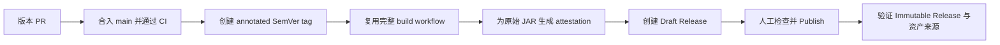

# 发布 Netherway

Netherway 的正式发布路线是：



日常 `main` / PR 构建只产生临时 Actions artifact；只有
`.github/workflows/release.yml` 可以创建 GitHub Release。正式发布始终需要维护者
人工检查 Draft 并点击 Publish，workflow 不会自动公开版本。

## 发布原则

- `mod/platform/forge-1.7.10/gradle.properties` 中的 `modVersion` 是版本事实；tag
  去掉开头 `v` 后必须与它完全一致。
- 每次发布从 tag 对应提交重新跑完整 Go、Java 与 Forge 门禁，不复用维护者本地文件。
- 构建、签名与上传操作的是同一个非 `-dev` 原始 JAR，不重新打包 ZIP。
- 正式资产只有 `netherway-forge-1.7.10-<version>.jar`。GitHub 自动显示的
  `Source code (zip)` 和 `Source code (tar.gz)` 不属于项目构建产物。
- 根目录 `build.sh` 生成的独立 agent 可能内嵌部署密钥，绝不能上传到公开 Release
  或 Actions artifact。公开 JAR 只包含 `mod/build-natives.sh` 生成的无密钥 agent。
- Release 发布后不覆盖资产、不移动或复用 tag；修复使用新的 patch 版本。

## 仓库的一次性设置

首次发布前检查以下设置，此后定期复核：

1. **Settings → Releases → Release immutability** 保持开启。它只保护开启后发布的
   Release。
2. `main` 的 required checks 与 `.github/branch-protection.json` 保持同步。
3. 建立匹配 `v*` 的 tag ruleset，只允许维护者创建版本 tag，并限制更新和删除。
4. GitHub Actions 允许 workflow 使用 `id-token: write` 与 `attestations: write`，以便
   release job 生成 build provenance。

## 1. 准备版本 PR

1. 完成计划内功能、修复和文档。
2. 用单独 PR 更新 `mod/platform/forge-1.7.10/gradle.properties` 中的
   `modVersion`，并同步受版本影响的文档。
3. 确认 PR 所有 required checks 通过后合入 `main`。
4. 拉取最新 `main`，确认本地 HEAD 就是刚通过 CI 的提交且工作区干净：

   ```bash
   git switch main
   git pull --ff-only origin main
   git status --short
   ```

## 2. 创建版本 tag

正式版 tag 使用 `vMAJOR.MINOR.PATCH`；预发布版也支持
`vMAJOR.MINOR.PATCH-rc.N`。创建 annotated tag，而不是 lightweight tag：

```bash
git tag -a v1.0.0 -m "Netherway v1.0.0"
git push origin v1.0.0
```

推送前再次确认 tag 指向预期提交，且 `v` 后面的版本与 `modVersion` 一致：

```bash
git show --no-patch v1.0.0
sed -n 's/^modVersion=//p' mod/platform/forge-1.7.10/gradle.properties
```

## 3. 等待自动发布流水线

tag push 会触发 `.github/workflows/release.yml`：

1. 校验 tag 是否为 SemVer，并与 `modVersion` 对齐；
2. 复用 `.github/workflows/build.yml`，执行完整 Go、Java 8/17/21/25 与 Forge 构建；
3. 定位唯一的非 `-dev` 发布 JAR；
4. 下载这次 workflow 构建出的同一个原始 JAR；
5. 使用 GitHub artifact attestation 为该 JAR 生成 build provenance；
6. 自动生成 Release Notes，并创建尚未公开的 Draft Release；
7. SemVer 带预发布后缀时，同时将 Draft 标为 prerelease。

任一步失败都不会产生公开 Release。修复问题后，删除尚未发布的 Draft（如果有），
按 tag ruleset 与仓库策略处理失败 tag，再从明确的新 tag 重新触发；不要把失败构建的
本地产物手工补传到 Release。

## 4. 人工检查并发布 Draft

打开仓库的 **Releases** 页面，逐项检查：

- tag、Release 标题和目标提交正确；
- 正式版/预发布状态正确；
- Release Notes 内容完整，没有不应公开的信息；
- 资产恰好只有 `netherway-forge-1.7.10-<version>.jar`；
- workflow 中的 build 与 attestation 步骤均已成功。

确认无误后手工点击 **Publish release**。Release immutability 会在发布后冻结 tag
与资产；此后若发现问题，创建新的 patch 版本，不修改旧版本。

## 5. 发布后验证

使用 GitHub CLI 验证 Release、下载资产并校验来源：

```bash
gh release verify v1.0.0 -R aUsernameWoW/netherway
gh release download v1.0.0 -R aUsernameWoW/netherway --pattern '*.jar'
gh release verify-asset v1.0.0 netherway-forge-1.7.10-1.0.0.jar \
  -R aUsernameWoW/netherway
gh attestation verify netherway-forge-1.7.10-1.0.0.jar \
  --repo aUsernameWoW/netherway
```

最后从公开 Release 页面重新下载一次 JAR，在干净的 Forge 1.7.10 客户端中完成基础
启动检查。若发布后验证失败，保留旧 Release 作为可审计记录，并用新 patch 版本修复。
